# Substance Zero #

## Summary ##

**A paragraph-length pitch for your game.**
Our game is a 2D top-down sci-fi roguelike action role-playing game. Play as Special Agent Nova, a highly trained agent of the Republic Solaris’ military sent to investigate a distress signal sent from a human energy research laboratory. You find a Krythan military force taking control of the lab. The Krythan want to use Substance Zero, a powerful energy source being researched by the lab’s scientists, to develop artificial intelligence driven cyborg tech. Fight your way through enemy filled dungeons on multiple planets, using unlockable weapons. Gain credits to spend in the shop on special power ups that will give an edge in combat against the Krythans. Travel between planets in your starship fighter through zero gravity space levels. Will the Krythan Empire conquer the human race using their advanced cyborg technology or will Special Agent Nova succeed in stopping their plot?

## Project Resources

[Web-playable version of our game.](https://tyger8540.itch.io/substance-zero)  
[Trailer](https://youtube.com)  
[Press Kit](https://dopresskit.com/)  
[Proposal](https://docs.google.com/document/d/1qUwD2NyjP9KsFODDz8VkGxmFNTsvUqGNmpAtfV8uMV0/edit)

## Gameplay Explanation ##

**In this section, explain how the game should be played. Treat this as a manual within a game. Explaining the button mappings and the most optimal gameplay strategy is encouraged.**

**Add it here if you did work that should be factored into your grade but does not fit easily into the proscribed roles! Please include links to resources and descriptions of game-related material that does not fit into roles here.**

# External Code, Ideas, and Structure #

If your project contains code that: 1) your team did not write, and 2) does not fit cleanly into a role, please document it in this section. Please include the author of the code, where to find the code, and note which scripts, folders, or other files that comprise the external contribution. Additionally, include the license for the external code that permits you to use it. You do not need to include the license for code provided by the instruction team.

The "power up shop" menu and "you died" screen use a shader shop_menu.gdshader that uses a small segment of code from a YouTube tutorial on how to make pause menus. The code is authored by YouTube creator "Gwizz" and found [here](https://www.youtube.com/watch?v=JEQR4ALlwVU&t=145s)

If you used tutorials or other intellectual guidance to create aspects of your project, include reference to that information as well.

# Main Roles #

Your goal is to relate the work of your role and sub-role in terms of the content of the course. Please look at the role sections below for specific instructions for each role.

Below is a template for you to highlight items of your work. These provide the evidence needed for your work to be evaluated. Try to have at least four such descriptions. They will be assessed on the quality of the underlying system and how they are linked to course content. 

*Short Description* - Long description of your work item that includes how it is relevant to topics discussed in class. [link to evidence in your repository](https://github.com/dr-jam/ECS189L/edit/project-description/ProjectDocumentTemplate.md)

Here is an example:  
*Procedural Terrain* - The game's background consists of procedurally generated terrain produced with Perlin noise. The game can modify this terrain at run-time via a call to its script methods. The intent is to allow the player to modify the terrain. This system is based on the component design pattern and the procedural content generation portions of the course. [The PCG terrain generation script](https://github.com/dr-jam/CameraControlExercise/blob/513b927e87fc686fe627bf7d4ff6ff841cf34e9f/Obscura/Assets/Scripts/TerrainGenerator.cs#L6).

You should replay any **bold text** with your relevant information. Liberally use the template when necessary and appropriate.

## Producer (Ty Matson)

**Describe the steps you took in your role as producer. Typical items include group scheduling mechanisms, links to meeting notes, descriptions of team logistics problems with their resolution, project organization tools (e.g., timelines, dependency/task tracking, Gantt charts, etc.), and repository management methodology.**

*Group Meetings* - We met over the development period quite often, at least a couple times per week. I used a Discord group message to house all of our group interactions, which is where I would schedule meetings and update group members on tasks that needed to be completed, like the [initial plan](https://docs.google.com/document/d/1qUwD2NyjP9KsFODDz8VkGxmFNTsvUqGNmpAtfV8uMV0/edit?usp=sharing) and the [progress report](https://docs.google.com/document/d/18yocdgACt19R112gTYJg1H385-jZhN3dEJ7GGehNjJY/edit?usp=sharing). This Discord chat also served as a place for members to let me know when they had made a pull request that had conflicts, as I was in charge of resolving any conflicts. Some of the logs are available on [Google Drive](https://drive.google.com/drive/folders/1--2yjTiwh3NUMc3L4eCcA95Jw-_be_C9?usp=sharing) or here [on GitHub](MediaFiles/DiscordLogs), where I included screenshots of our Discord chats throughout development.

*Gantt Chart* - Our group used a Gantt chart to create a development timeline for our game. This timeline helped us to see how on track we were when submitting a progress report, as well as to use as a reference when moving on to the next task. I created a [short tutorial](https://drive.google.com/file/d/19N0ylwz7VY0-sVO__QapEyRM6iK0NzDz/view?usp=sharing) on how to add to the Gantt chart, as it took some figuring out for me to get it set up, so I figured it would be seful to share what I had found. The Gantt chart can be found on our [initial plan](https://docs.google.com/document/d/1qUwD2NyjP9KsFODDz8VkGxmFNTsvUqGNmpAtfV8uMV0/edit?usp=sharing) document.

*GitHub Management* - As mentioned in the Group Meetings section above, I created and maintained Substance Zero's [GitHub repository](https://github.com/Tyger8540/substance-zero/tree/main). First I had everyone in the group send their GitHub username so that I could add everyone to the repository as a contributor. Next I created another [tutorial](https://drive.google.com/file/d/1N9bHTKdZJWzt-f9q-TLOJ56X5fhgkoD3/view?usp=sharing), this time on using GitHub Desktop to manage a Godot game, as I thought that would be helpful in case anyone was unfamiliar with the GitHub + Godot workflow. The basic GitHub rules for the GitHub repository was to create a new branch off of main when working on a new feature, then create a pull request to merge your changes with the main branch. I was in charge of resolving any conflicts that would come up with merging, so I had to understand all parts of the project. If there happened to be no merge conflicts, group members were free to merge with the main branch, as my input was not needed.

*GitHub Conflicts* - There were a surprisingly small amount of tough merge conflicts over the course of development. The first conflict arose when two members were trying to edit the same files in different ways, which was resolved by adding the less complex changes to the other person's work. The only other major conflict was when the merging of a branch with main caused many files to be overwritten, which did not show up in the merge conflicts, making it extra confusing why features stopped working in the game. To fix this, I went through the commit that overwrote a lot of files, and I re-implemented all of the overwrites that were not intended. One other conflict occurred when one of the group members tried to resolve their merge conflicts, which did not end up working correctly. I resolved this issue by reverting their commit and properly handing all of the merge conflicts the second time around, which was not a big deal. Besides these few conflicts, the GitHub management cycle went pretty smoothly, and I definitely learned a lot about managing a Godot project through GitHub, as well as learning how the inner files like the project.godot and tscn (scene) files are structured.

*itch.io Page* - Creating the [itch.io page](https://tyger8540.itch.io/substance-zero) involved building the Godot project and uploading the webgl build to the itch page. I am very familiar with itch.io so this process went very smoothly.

## User Interface and Input (Chase Keighley)

*UI Theme* - A theme was created to easily style multiple UI elements including buttons, panels, etc. Found in Assets folder.

*Navigational Menus* - I implemented multiple menus to navigate between scenes and display certain information. The level select menu did not end up being needed, as time constraints prevented our team from fully realizing multiple levels. The options menu displays the game's controls. The pause and you died menus have options to return to the start menu. Scripts attached to the menus manage saving and loading player states and changing scenes ([example](https://github.com/Tyger8540/substance-zero/blob/359171f39d3d837c7d47d9aad4af6176470ef81c/substance-zero/scripts/UI/pause_menu.gd#L23)) Overall these menus facilitate gameplay transitions and provide nice "spacey" visuals to aesthetically ground the game.

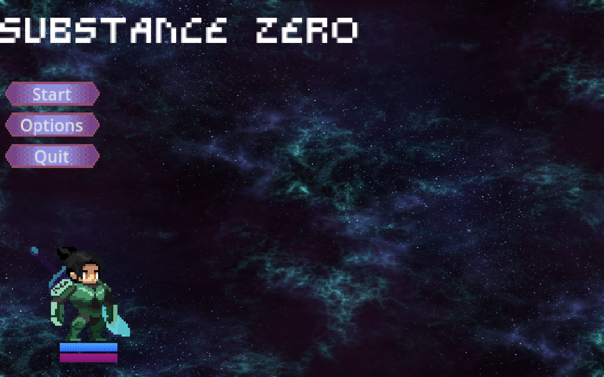

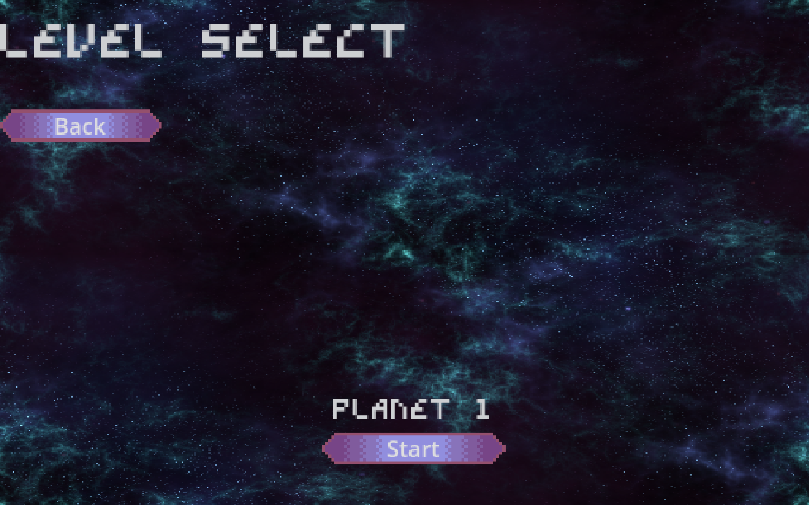

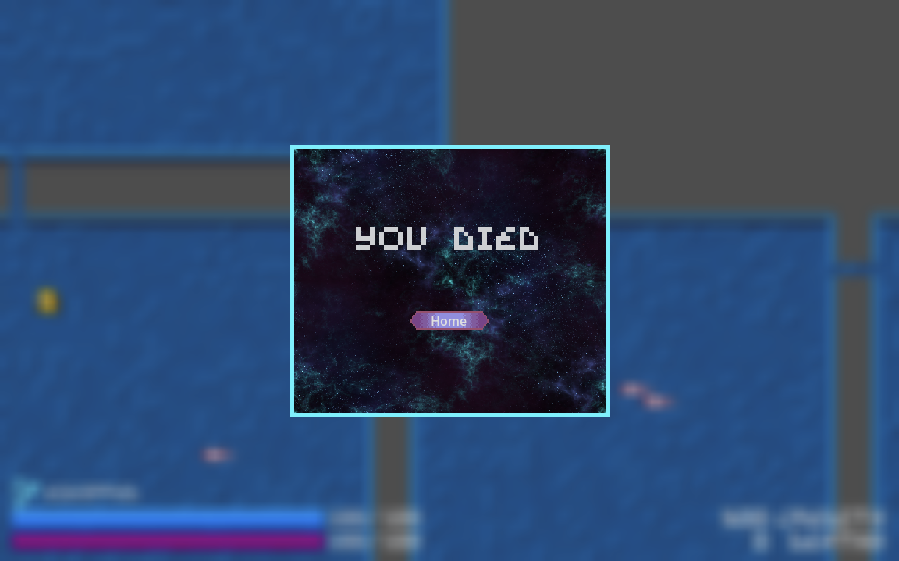

*Signals* - [signals.gd](https://github.com/Tyger8540/substance-zero/blob/359171f39d3d837c7d47d9aad4af6176470ef81c/substance-zero/scripts/autoload/signals.gd#L1) was developed to have global signals able to communicate necessary information for updating UI elements (mainly for the powerup shop)

*Power Up Shop* - This UI element is displayed when player presses "B" to buy power ups based on current amount of credits. The shop [randomly generates](https://github.com/Tyger8540/substance-zero/blob/359171f39d3d837c7d47d9aad4af6176470ef81c/substance-zero/scripts/UI/shop_menu.gd#L36) unique power ups for the player to buy and displays them using "powerup_shop_display" scenes instantiated in the menu.

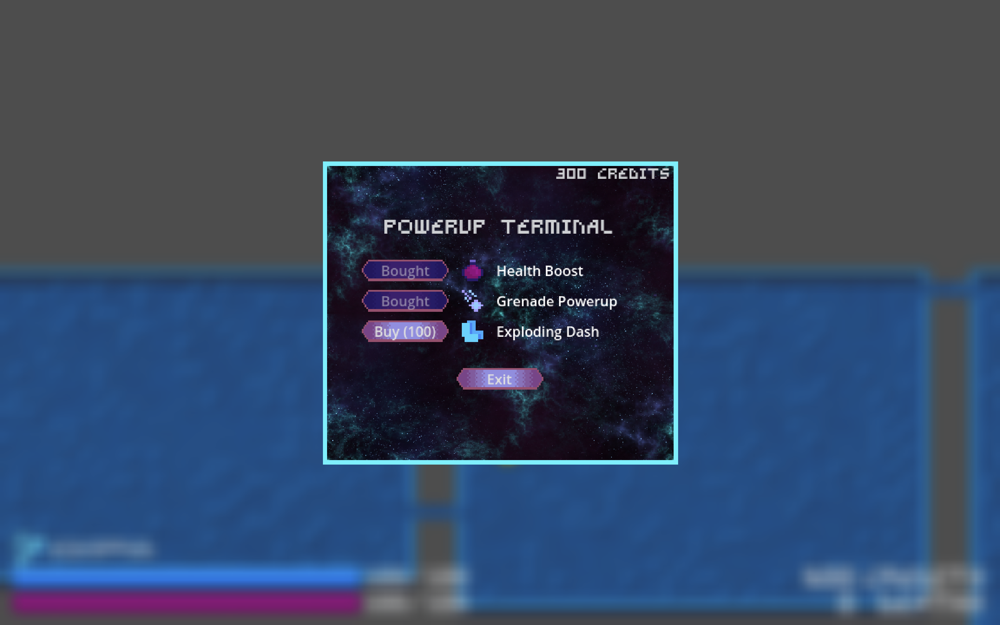

*Player HUD* - The "heads up display" displays currently equipped weapon, shield and health bars (with current and total values), power ups the player has and their uses, credits, and player death count. The HUD enhances gameplay by presenting pertinent gameplay information in an easily accessible manner. [This script](https://github.com/Tyger8540/substance-zero/blob/359171f39d3d837c7d47d9aad4af6176470ef81c/substance-zero/scripts/UI/player_hud.gd#L29) handles updating values the HUD displays.

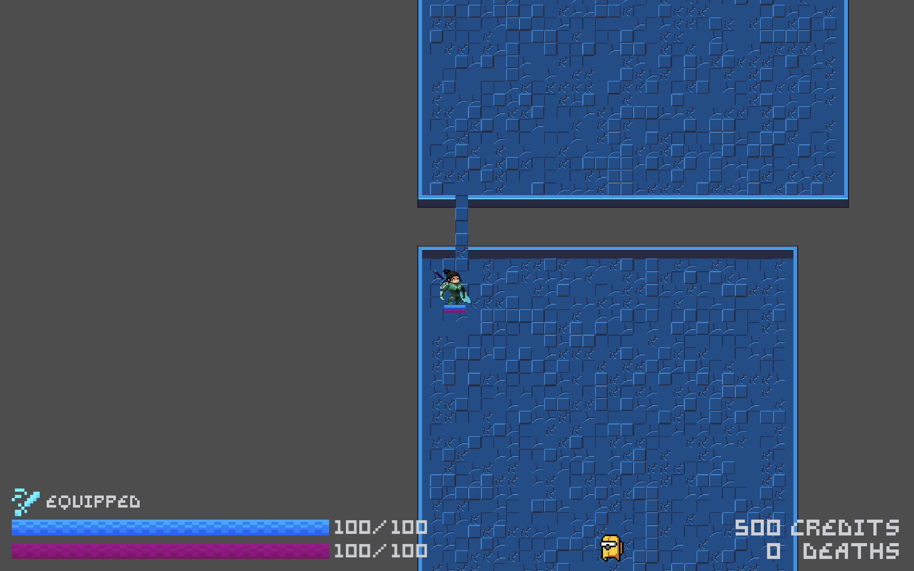

*Health and Shield Bars* - Health and shield bars were created with this attached [script](https://github.com/Tyger8540/substance-zero/blob/359171f39d3d837c7d47d9aad4af6176470ef81c/substance-zero/scripts/UI/health_shield_bars.gd#L17) to display health and shield of characters. This provides visual feedback for status of the player and enemies.

*Dialogue Boxes* - I designed dialogue boxes which provide a UI space for character dialogue to be displayed.

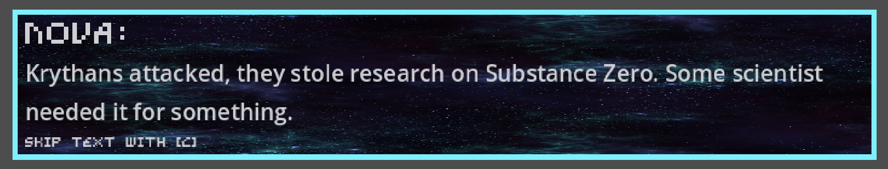

*Input Configuration* - There are two input configurations for two types of gameplay within our game: a top-down 2D design for on-ground dungeon combat levels, and a top down 2D in-space. The inputs configuration for the dungeon combat levels is a fairly basic W,A,S,D scheme, using left click or SHIFT to attack, SPACE to dash, and some other buttons to activate power ups and menus (described in the options menu). I developed the input configuration idea for the space levels, while I also coordinated input configuration with the rest of the team, specifically when implementing the power up inputs. The input supports computer platforms. The menus rely on mouse direction, while combat can optionally use a mouse/mousepad and keyboard or keyboard only.

## Movement/Physics

**Describe the basics of movement and physics in your game. Is it the standard physics model? What did you change or modify? Did you make your movement scripts that do not use the physics system?**

## Animation and Visuals (Ruohan Huang)

**List your assets, including their sources and licenses.**

**Describe how your work intersects with game feel, graphic design, and world-building. Include your visual style guide if one exists.**

*Characters Animations:* - For the player’s animation, the sprites sheet that I used only had the animation for sword attacks. Because our game takes place in a sci-fi setting, the group decided that the player would have a gun. So I decided to take the gun from the boss’s sprite sheet and add it to the player to make a gun attacking animation.
For each of the characters on screen, including the player, the enemies and the bosses, I created an animation tree to manage their animation with their state. When they are not moving, the animation tree state would set idle to True and the idle animation would play. Same with taking damage, walking, and attacking. The animation would set the appropriate state to true and the corresponding animation would play.

Instead of using the animation player to control the hurtbox for the character, our group decided to make hurtbox and hitbox classes and use that to generate attacks that damage other players.

*Player Scene:* \
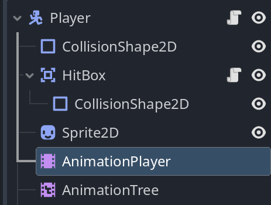

*Player Animation Tree:* \
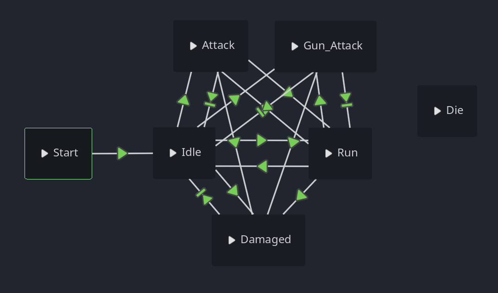

*Player Animation Player (Attack Animation):* \
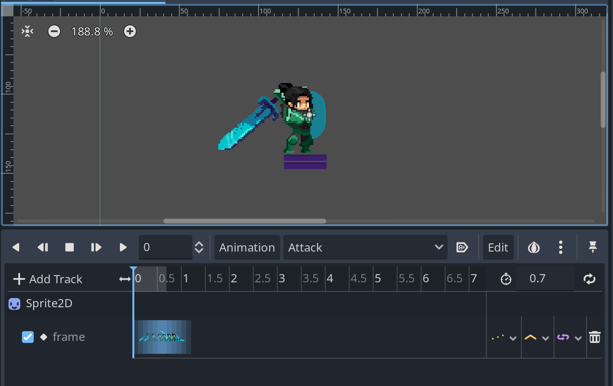

*Powerup Animations:* - For the power up animation, the sprites were stored in individual images instead of being on a sprite sheet. So for those animations, I used an animated sprite and an animation player to manage the animations. The animated sprite allows an animation to be played from a collection of images. I used the animation player to toggle off the hurtbox of the grenade so it only hurts the enemies when they step into the explosion. 

*Grenade Powerup Animation Player:* \
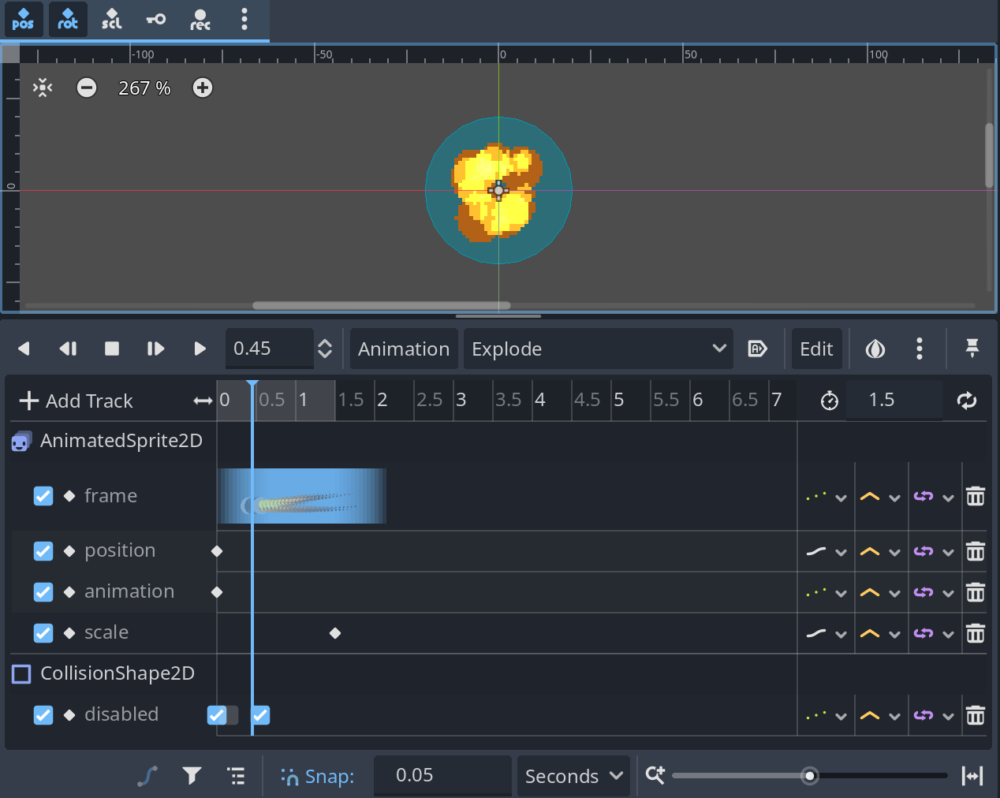

*Grenade Powerup AnimatedSprite2D:* \
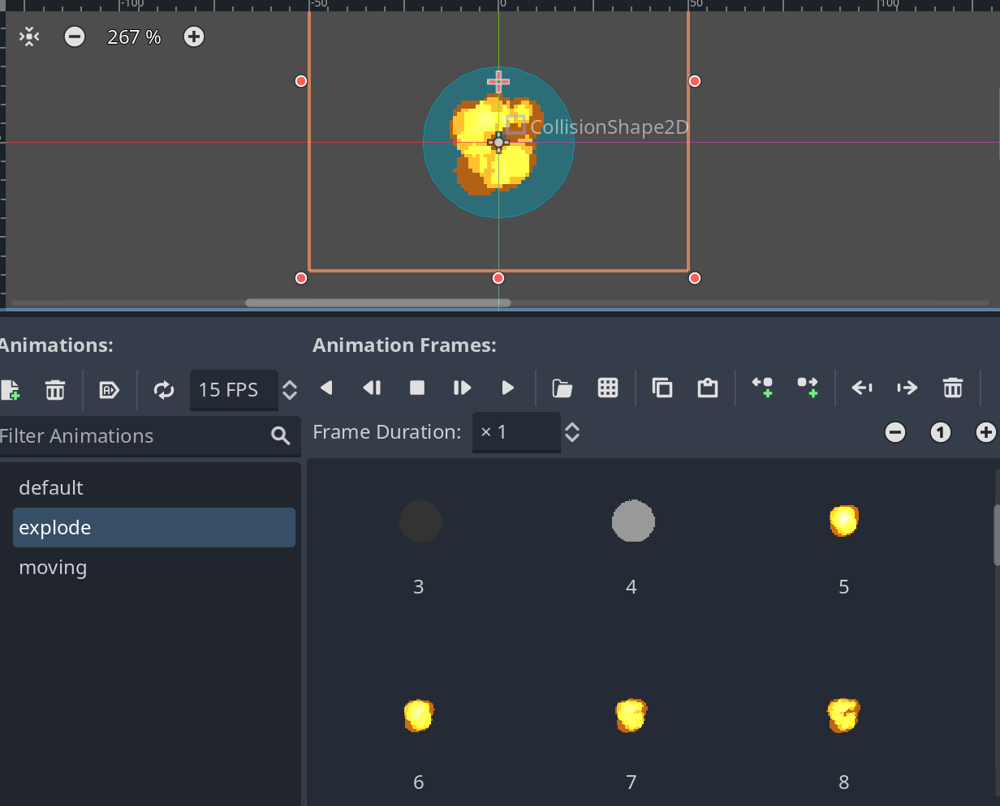

*Visuals:* -  I had to use a lot of different assets and try to match them together to fit the aesthetics of sci-fi that we were going for. All of the sprites had to be in a pixel art style to create a cohesive feel to our game. A lot of the sprites that I found were cut out of the game due to part of the planned gameplay being cut out of the game, including tilesets for 4 more planets, 4 more bosses, 2 more types of characters. The sprites that ended up being used are:

- [Player sprite](https://unknown-soldiersz.itch.io/platform-character-warrior):
    - License: This asset pack can be used in free and commercial projects. You can modify the assets as you need. You may not repackage, redistribute or resell the assets, no matter how much they are modified. Credit is not necessary, but always appreciated.
    - Sprite made by: Unknown Soldier
- [Boss Sprite](https://secrethideout.itch.io/team-wars-platformer-battle):
    - License: May use the assets for non-commercial & commercial projects
    - Sprite made by: Secret Hideout
- [Enemy Sprite](https://dani-maccari.itch.io/nuclear-leak-character-asset-pack):
    - License: Can be used on free and commercial projects with credit
    - Sprite made by: Dani Maccari
- [Projectile Sprites](https://foozlecc.itch.io/sci-fi-lab-droids):
    - License: (Creative Commons Zero, CC0)
    - Sprite made by: Foozle
- [NPC Sprite](https://free-game-assets.itch.io/free-sci-fi-antagonists-pixel-character-pack):
    - License: May use the assets for non-commercial & commercial projects
    - Sprite made by: Craftpix.net
- [Bubble Shield Sprite](https://999overlap.itch.io/force-shield-2d-effects-pack):
    - License: May use the assets for non-commercial & commercial projects
    - Sprite made by: 999overlap
- [Grenade Sprite](https://surfacetoash.itch.io/kaboom-explosives-asset-pack)
    - License: May use the assets for non-commercial & commercial projects
- [Space Sprite](https://screamingbrainstudios.itch.io/seamless-space-backgrounds):
    - License: CC0/Public Domain
    - Sprite made by: Screaming Brain Studios
- [Spaceship Sprite](https://foozlecc.itch.io/void-main-ship):
    - License: CC0/Public Domain
    - Sprite made by: Foozle
- [Explosive Sprite](https://xyezawr.itch.io/free-pixel-effects-pack-4-explosions?download)
    - License: May use the assets for non-commercial & commercial projects
    - Sprite made by: XYEzawr
- [UI Sprite1](https://shiva89.itch.io/pixel-game-ui):
    - License: May use the assets for non-commercial & commercial projects
    - Sprite made by: Shiv89
- [UI Sprite 2](https://kick14.itch.io/renpy-sci-fi-gui-asset-2)
    - License: Not listed
    - Sprite made by: Kick14
- [Font Sprite](https://jotson.itch.io/gravity-pixel-font):
    - License: May use the assets for non-commercial & commercial projects
    - Sprite made by: jotson
- [Planet Tilesheet](https://rgsdev.itch.io/free-cc0-top-down-tileset-template-pixel-art)
    - License: CC0/Public Domain
    - Sprite made by: RGS_Dev

## Game Logic

**Document the game states and game data you managed and the design patterns you used to complete your task.**

## Level Generation (Aryan Saneinejad)

*Graph-Based-Algorithm* The level generation system utilizes a graph-based algorithm to ensure logical room connectivity and navigability. Each room in the level is represented as a node in the graph, and edges define the possible pathways between rooms. The algorithm dynamically generates these nodes and edges during runtime, ensuring that all rooms are connected in a meaningful sequence. The placement of special rooms (e.g., shop, treasure, and boss) follows a priority-based approach to guarantee their accessibility at appropriate stages of the level.

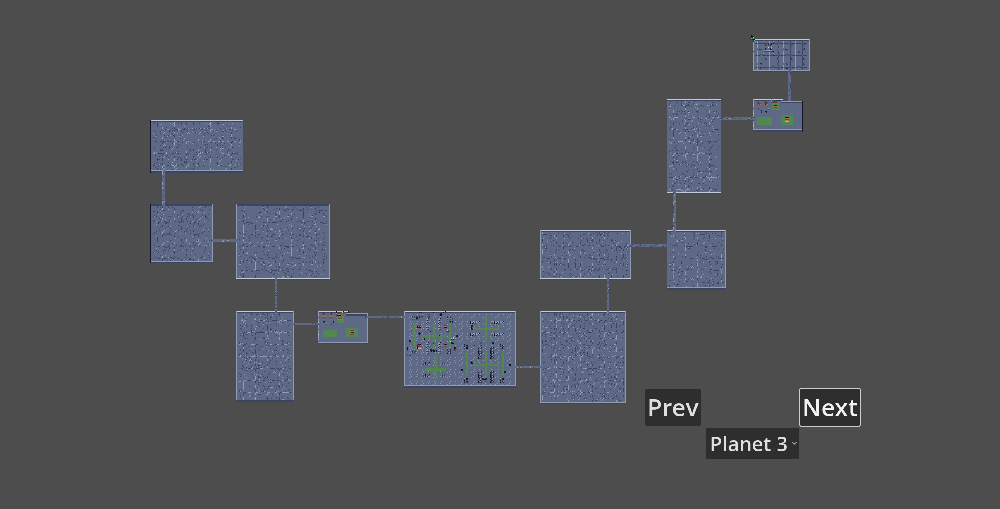

*Procedural Level Generation System* - The game's levels are procedurally generated, creating a series of interconnected rooms for Planet 1. The system dynamically generates room layouts at runtime, combining the graph-based algorithm with modular room templates. Each room type (combat, shop, treasure, boss) is designed as a reusable template, ensuring scalability and ease of integration for future planets. The implementation applies principles from the procedural content generation (PCG), balancing randomness with structure.
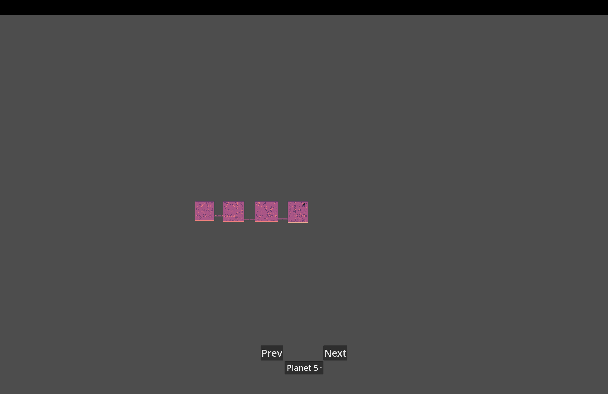
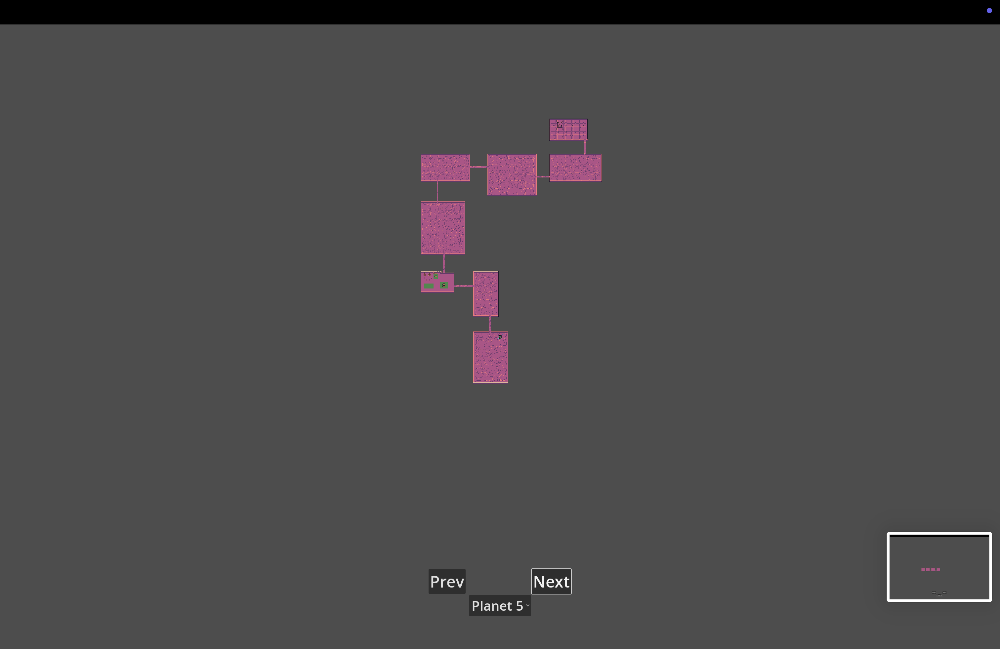
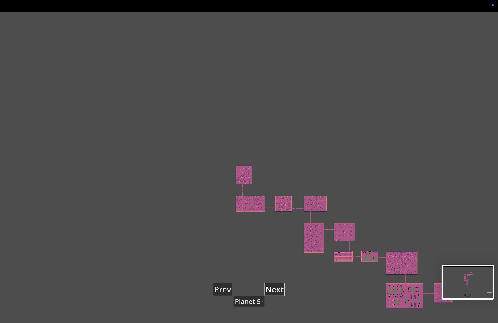

*Environmental Hazards in Combat Rooms* - Combat rooms are designed as modular templates that dynamically adapt to gameplay needs. Each combat room includes predefined spawn points for enemies and loot, with enemy types and numbers randomized at runtime. Additionally, obstacles and hazards are placed procedurally to create unique combat scenarios for each encounter. These templates are developed using the factory design pattern, allowing reusable and scalable room designs that can be dynamically instantiated during level generation.
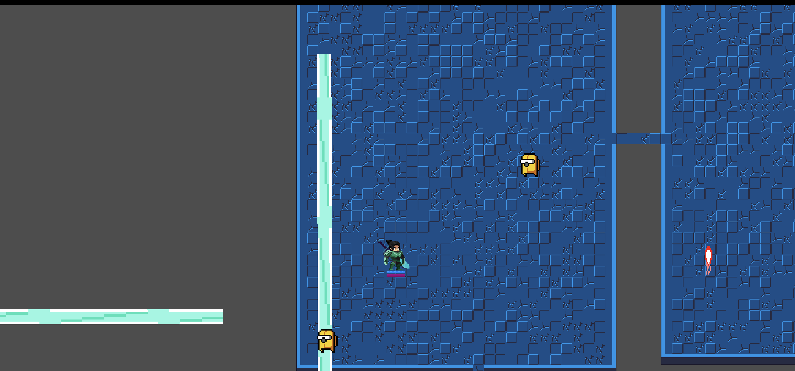

*Combat Room* - Combat rooms are designed as modular templates that dynamically adapt to gameplay needs. Each combat room includes predefined spawn points for enemies and loot, with enemy types and numbers randomized at runtime. Additionally, obstacles and hazards are placed procedurally to create unique combat scenarios for each encounter. These templates are developed using the factory design pattern, allowing reusable and scalable room designs that can be dynamically instantiated during level generation. 

# Sub-Roles

## Audio (Aryan Saneinejad)

**List your assets, including their sources and licenses.**

**Describe the implementation of your audio system.**

**Document the sound style.** 
The audio system for the game is designed to enhance immersion and player feedback. 
It incorporates various sound effects and music elements tailored to the sci-fi roguelike theme. 
Each sound has been carefully chosen to align with the game's futuristic and intense atmosphere. The only problem I encountered was the file extensions which Godot gave me errors. 
This document [Google Docs script](https://docs.google.com/document/d/1nLYpXAx5Cx0RoTBfg_2F8WWzAK9lS0I-pFFLdZd6Wnc/edit?tab=t.0) provides details about the sound style for each part. 

- [Player Getting Hit](https://mixkit.co/free-sound-effects/game/)
    - License: Items under the Mixkit Sound Effects Free License can be used in your commercial and non-commercial projects for free.
    - Sprite made by: Envato
- [Player Dash ](https://mixkit.co/free-sound-effects/game/)
    - License: Items under the Mixkit Sound Effects Free License can be used in your commercial and non-commercial projects for free.
    - Sprite made by: Envato
- [Player Death](https://mixkit.co/free-sound-effects/game/)
    - License: Items under the Mixkit Sound Effects Free License can be used in your commercial and non-commercial projects for free.
    - Sprite made by: Envato
- [Player Getting Hit](https://mixkit.co/free-sound-effects/game/)
    - License: Items under the Mixkit Sound Effects Free License can be used in your commercial and non-commercial projects for free.
    - Sprite made by: Envato
- [Player Footsteps](https://mixkit.co/free-sound-effects/game/)
    - License: Items under the Mixkit Sound Effects Free License can be used in your commercial and non-commercial projects for free.
    - Sprite made by: Envato

## Gameplay Testing

**Add a link to the full results of your gameplay tests.**

**Summarize the key findings from your gameplay tests.**

## Narrative Design (Chase Keighley)

*Script* - This 10 page [Google Docs script](https://docs.google.com/document/d/1AzL-Xw95xl-VU2a_c_DNzcz6L4h6DknmAcX1kDs1e6U/edit?usp=sharing) provides a story outline, characters and organizations, character motivations, description of locations, dialogue for 5 planet dungeons, 5 boss battles, and space levels between each planet. The story motivates much of the visual aesthetics in the UI and level/character assets (however many of the assets Ruohan got to reflect different levels and story elements were unable to be used). The story also provides an emotional and direct narrative progression to the gameplay. Unfortunately, much of the dialogue and level locations are not fully realized within the game due to time constraints faced by our team so the narrative is not extremely apparent in the game's current state.

## Press Kit and Trailer (Ruohan Huang)

**Include links to your presskit materials and trailer.**

**Describe how you showcased your work. How did you choose what to show in the trailer? Why did you choose your screenshots?**

## Game Feel and Polish

**Document what you added to and how you tweaked your game to improve its game feel.**

## Power Up System

**Describe the power ups implemented and how the power up system functions.
