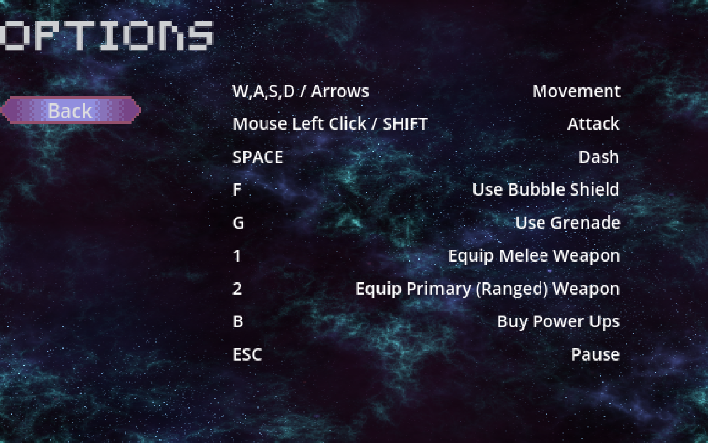

# Substance Zero #

## Summary ##

**A paragraph-length pitch for your game.**
Our game is a 2D top-down sci-fi roguelike action role-playing game. Play as Special Agent Nova, a highly trained agent of the Republic Solaris’ military sent to investigate a distress signal sent from a human energy research laboratory. You find a Krythan military force taking control of the lab. The Krythan want to use Substance Zero, a powerful energy source being researched by the lab’s scientists, to develop artificial intelligence driven cyborg tech. Fight your way through enemy filled dungeons on multiple planets, using unlockable weapons. Gain credits to spend in the shop on special power ups that will give an edge in combat against the Krythans. Travel between planets in your starship fighter through zero gravity space levels. Will the Krythan Empire conquer the human race using their advanced cyborg technology or will Special Agent Nova succeed in stopping their plot?

## Project Resources

[Web-playable version of our game.](https://tyger8540.itch.io/substance-zero)  
[Trailer](https://youtu.be/fXkR6jIqcSI)  
[Press Kit](https://ruohan8.github.io/Substance_Zero_Website/)  
[Proposal](https://docs.google.com/document/d/1qUwD2NyjP9KsFODDz8VkGxmFNTsvUqGNmpAtfV8uMV0/edit)

## Gameplay Explanation ##

The gameplay loop of our game, Substance Zero, is fairly straightforward, at least for us video game enthusiasts. The top-down movement and combat can be controlled with the typical keyboard (and optionally mouse). The controls can be seen here:  These controls are accessible from the game's main menu screen. To play the game, the main objective is to kill all of the enemies using your melee and ranged weapons, as well as any power ups you may choose to purchase. The main objective for the space section is to not get hit by asteroids, as that will damage your ship. In simpler terms, the best way to play the game is to kill (or dodge) the enemies before they can kill you.

# External Code, Ideas, and Structure #

If your project contains code that: 1) your team did not write, and 2) does not fit cleanly into a role, please document it in this section. Please include the author of the code, where to find the code, and note which scripts, folders, or other files that comprise the external contribution. Additionally, include the license for the external code that permits you to use it. You do not need to include the license for code provided by the instruction team.

The "power up shop" menu and "you died" screen use a shader shop_menu.gdshader that uses a small segment of code from a YouTube tutorial on how to make pause menus. The code is authored by YouTube creator "Gwizz" and found [here](https://www.youtube.com/watch?v=JEQR4ALlwVU&t=145s)

If you used tutorials or other intellectual guidance to create aspects of your project, include reference to that information as well.

citations for scripts that game logic has worked on:  

[command.gd](https://github.com/Tyger8540/substance-zero/blob/3ce533b002565111f88e493699996eeb397f27e1/substance-zero/scripts/commands/command.gd#L1) was taken from command.gd from exercise 1  

all scripts in scripts/commands/cardinal_directions and scripts/commands/diagonal_directions are modified from move_left_command.gd from exercise 1  

[idle_command.gd](https://github.com/Tyger8540/substance-zero/blob/3ce533b002565111f88e493699996eeb397f27e1/substance-zero/scripts/commands/idle_command.gd#L1) was modified from idle.gd from exercise 1  

[hurtbox.gd](https://github.com/Tyger8540/substance-zero/blob/3ce533b002565111f88e493699996eeb397f27e1/substance-zero/scripts/hurt_box.gd#L1) was modified from command.gd from exercise 1  

[attack.gd](https://github.com/Tyger8540/substance-zero/blob/3ce533b002565111f88e493699996eeb397f27e1/substance-zero/scripts/commands/attack.gd#L1) was modified from attack_command.gd from exercise 1  

[durative_move_left.gd](https://github.com/Tyger8540/substance-zero/blob/3ce533b002565111f88e493699996eeb397f27e1/substance-zero/scripts/durative_commands/cardinal_directions/durative_move_left.gd#L1) is from durative_move_left_command.gd from exercise 1  

[durative_move_right.gd](https://github.com/Tyger8540/substance-zero/blob/3ce533b002565111f88e493699996eeb397f27e1/substance-zero/scripts/durative_commands/cardinal_directions/durative_move_right.gd#L1) is from durative_move_right_command.gd from exercise 1  

[durative_move_up.gd](https://github.com/Tyger8540/substance-zero/blob/3ce533b002565111f88e493699996eeb397f27e1/substance-zero/scripts/durative_commands/cardinal_directions/durative_move_up.gd#L1) and durative_move_down.gd are modified from durative_move_left_command.gd from exercise 1  

all scripts in scripts/durative_commands/diagonal_directions are modified from durative_move_left_command.gd from exercise 1  

[durative_animation_command.gd](https://github.com/Tyger8540/substance-zero/blob/3ce533b002565111f88e493699996eeb397f27e1/substance-zero/scripts/durative_commands/durative_animation_command.gd#L1) is from durative_animation_command.gd from exercise 1  

[durative_idle.gd](https://github.com/Tyger8540/substance-zero/blob/3ce533b002565111f88e493699996eeb397f27e1/substance-zero/scripts/durative_commands/durative_idle.gd#L1) is from durative_idle_command.gd from exercise 1  

all scripts in scripts/specs and scripts/factories used the factory design pattern from exercise 3  

all scripts in scripts/weapons have segments of code from exercise 1 and 3. If labeled "from exercise 1", 
the code for starting a timer is from durative_animation_command.gd which is found [here](https://github.com/Tyger8540/substance-zero/blob/3ce533b002565111f88e493699996eeb397f27e1/substance-zero/scripts/weapons/melee.gd#L14), [here](https://github.com/Tyger8540/substance-zero/blob/3ce533b002565111f88e493699996eeb397f27e1/substance-zero/scripts/weapons/piercing_projectile.gd#L25), 
and [here](https://github.com/Tyger8540/substance-zero/blob/3ce533b002565111f88e493699996eeb397f27e1/substance-zero/scripts/weapons/projectile.gd#L25), and bind_commands() is modified from bind_player_input_commands() 
from player.gd which is found [here](https://github.com/Tyger8540/substance-zero/blob/3ce533b002565111f88e493699996eeb397f27e1/substance-zero/scripts/weapons/piercing_projectile.gd#L17) and 
[here](https://github.com/Tyger8540/substance-zero/blob/3ce533b002565111f88e493699996eeb397f27e1/substance-zero/scripts/weapons/projectile.gd#L17). If labeled "from exercise 3", 
the code for checking if a timer is not null and has stopped is from shield.gd from exercise 3 which is found [here](https://github.com/Tyger8540/substance-zero/blob/3ce533b002565111f88e493699996eeb397f27e1/substance-zero/scripts/weapons/melee.gd#L22), 
[here](https://github.com/Tyger8540/substance-zero/blob/3ce533b002565111f88e493699996eeb397f27e1/substance-zero/scripts/weapons/piercing_projectile.gd#L44), and 
[here](https://github.com/Tyger8540/substance-zero/blob/3ce533b002565111f88e493699996eeb397f27e1/substance-zero/scripts/weapons/projectile.gd#L46).

character.gd have segments of code from exercise 1 and 3. The enum Facing is modified from exercise 1 which is found [here](https://github.com/Tyger8540/substance-zero/blob/6fe870fbd1e4a031b5962be8717d6f1098d7ee62/substance-zero/scripts/character.gd#L12). The variable facing is from 
the variable facing from character.gd from exercise 1 which is found [here](https://github.com/Tyger8540/substance-zero/blob/6fe870fbd1e4a031b5962be8717d6f1098d7ee62/substance-zero/scripts/character.gd#L118). 
Both are also found in hurt_box.gd [here](https://github.com/Tyger8540/substance-zero/blob/6fe870fbd1e4a031b5962be8717d6f1098d7ee62/substance-zero/scripts/hurt_box.gd#L5) and [here](https://github.com/Tyger8540/substance-zero/blob/6fe870fbd1e4a031b5962be8717d6f1098d7ee62/substance-zero/scripts/hurt_box.gd#L12). 
[take_damage()](https://github.com/Tyger8540/substance-zero/blob/6fe870fbd1e4a031b5962be8717d6f1098d7ee62/substance-zero/scripts/character.gd#L128) is modified from take_damage() from player.gd from exercise 1. 
[attack_with_melee()](https://github.com/Tyger8540/substance-zero/blob/6fe870fbd1e4a031b5962be8717d6f1098d7ee62/substance-zero/scripts/character.gd#L175), [fire_laser_gun()](https://github.com/Tyger8540/substance-zero/blob/6fe870fbd1e4a031b5962be8717d6f1098d7ee62/substance-zero/scripts/character.gd#L208), [fire_piercing_gun()](https://github.com/Tyger8540/substance-zero/blob/6fe870fbd1e4a031b5962be8717d6f1098d7ee62/substance-zero/scripts/character.gd#L235), and [fire_all_directions_gun()](https://github.com/Tyger8540/substance-zero/blob/6fe870fbd1e4a031b5962be8717d6f1098d7ee62/substance-zero/scripts/character.gd#L262) all make specs and factories, and then build 
a new hurtbox which used the factory design pattern from exercise 3  

the node CutsceneManager is from the node CutsceneManager from exercise 1  

[cutscene_manager.gd](https://github.com/Tyger8540/substance-zero/blob/3ce533b002565111f88e493699996eeb397f27e1/substance-zero/scripts/cutscene_manager.gd#L1) is from cutscene_manager.gd from exercise 1  

[cutscene_trigger.gd](https://github.com/Tyger8540/substance-zero/blob/3ce533b002565111f88e493699996eeb397f27e1/substance-zero/scripts/cutscene_trigger.gd#L1) is from boss_encounter_trigger.gd from exercise 1  

[enemy_manager.gd](https://github.com/Tyger8540/substance-zero/blob/3ce533b002565111f88e493699996eeb397f27e1/substance-zero/scripts/enemy_manager.gd#L1) and [hazard_manager.gd](https://github.com/Tyger8540/substance-zero/blob/3ce533b002565111f88e493699996eeb397f27e1/substance-zero/scripts/hazard_manager.gd#L1) are modified from cutscene_manager.gd from exercise 1  

[hit_box.gd](https://github.com/Tyger8540/substance-zero/blob/3ce533b002565111f88e493699996eeb397f27e1/substance-zero/scripts/hit_box.gd#L1) is modified from hit_box.gd from exercise 1

[hurt_box.gd](https://github.com/Tyger8540/substance-zero/blob/3ce533b002565111f88e493699996eeb397f27e1/substance-zero/scripts/hurt_box.gd#L1) is modified from hurt_box.gd from exercise 1  

in player.gd, [bind_player_input_commands()](https://github.com/Tyger8540/substance-zero/blob/3ce533b002565111f88e493699996eeb397f27e1/substance-zero/scripts/player.gd#L21) and [unbind_player_input_commands()](https://github.com/Tyger8540/substance-zero/blob/3ce533b002565111f88e493699996eeb397f27e1/substance-zero/scripts/player.gd#L44) are from player.gd from exercise 1  

the node ProjectileSpawn is from the node ProjectileSpawn in weapon.tscn from exercise 3  

the node EnemySpawn is modified from the node ProjectileSpawn in weapon.tscn from exercise 3  

all scripts that game logic has worked on also has citations within the scripts  

# Main Roles #

Your goal is to relate the work of your role and sub-role in terms of the content of the course. Please look at the role sections below for specific instructions for each role.

Below is a template for you to highlight items of your work. These provide the evidence needed for your work to be evaluated. Try to have at least four such descriptions. They will be assessed on the quality of the underlying system and how they are linked to course content. 

*Short Description* - Long description of your work item that includes how it is relevant to topics discussed in class. [link to evidence in your repository](https://github.com/dr-jam/ECS189L/edit/project-description/ProjectDocumentTemplate.md)

Here is an example:  
*Procedural Terrain* - The game's background consists of procedurally generated terrain produced with Perlin noise. The game can modify this terrain at run-time via a call to its script methods. The intent is to allow the player to modify the terrain. This system is based on the component design pattern and the procedural content generation portions of the course. [The PCG terrain generation script](https://github.com/dr-jam/CameraControlExercise/blob/513b927e87fc686fe627bf7d4ff6ff841cf34e9f/Obscura/Assets/Scripts/TerrainGenerator.cs#L6).

You should replay any **bold text** with your relevant information. Liberally use the template when necessary and appropriate.

## Producer (Ty Matson)

**Describe the steps you took in your role as producer. Typical items include group scheduling mechanisms, links to meeting notes, descriptions of team logistics problems with their resolution, project organization tools (e.g., timelines, dependency/task tracking, Gantt charts, etc.), and repository management methodology.**

*Group Meetings* - We met over the development period quite often, at least a couple times per week. I used a Discord group message to house all of our group interactions, which is where I would schedule meetings and update group members on tasks that needed to be completed, like the [initial plan](https://docs.google.com/document/d/1qUwD2NyjP9KsFODDz8VkGxmFNTsvUqGNmpAtfV8uMV0/edit?usp=sharing) and the [progress report](https://docs.google.com/document/d/18yocdgACt19R112gTYJg1H385-jZhN3dEJ7GGehNjJY/edit?usp=sharing). This Discord chat also served as a place for members to let me know when they had made a pull request that had conflicts, as I was in charge of resolving any conflicts. Some of the logs are available on [Google Drive](https://drive.google.com/drive/folders/1--2yjTiwh3NUMc3L4eCcA95Jw-_be_C9?usp=sharing) or here [on GitHub](MediaFiles/DiscordLogs), where I included screenshots of our Discord chats throughout development.

*Gantt Chart* - Our group used a Gantt chart to create a development timeline for our game. This timeline helped us to see how on track we were when submitting a progress report, as well as to use as a reference when moving on to the next task. I created a [short tutorial](https://drive.google.com/file/d/19N0ylwz7VY0-sVO__QapEyRM6iK0NzDz/view?usp=sharing) on how to add to the Gantt chart, as it took some figuring out for me to get it set up, so I figured it would be seful to share what I had found. The Gantt chart can be found on our [initial plan](https://docs.google.com/document/d/1qUwD2NyjP9KsFODDz8VkGxmFNTsvUqGNmpAtfV8uMV0/edit?usp=sharing) document.

*GitHub Management* - As mentioned in the Group Meetings section above, I created and maintained Substance Zero's [GitHub repository](https://github.com/Tyger8540/substance-zero/tree/main). First I had everyone in the group send their GitHub username so that I could add everyone to the repository as a contributor. Next I created another [tutorial](https://drive.google.com/file/d/1N9bHTKdZJWzt-f9q-TLOJ56X5fhgkoD3/view?usp=sharing), this time on using GitHub Desktop to manage a Godot game, as I thought that would be helpful in case anyone was unfamiliar with the GitHub + Godot workflow. The basic GitHub rules for the GitHub repository was to create a new branch off of main when working on a new feature, then create a pull request to merge your changes with the main branch. I was in charge of resolving any conflicts that would come up with merging, so I had to understand all parts of the project. If there happened to be no merge conflicts, group members were free to merge with the main branch, as my input was not needed.

*GitHub Conflicts* - There were a surprisingly small amount of tough merge conflicts over the course of development. The first conflict arose when two members were trying to edit the same files in different ways, which was resolved by adding the less complex changes to the other person's work. The only other major conflict was when the merging of a branch with main caused many files to be overwritten, which did not show up in the merge conflicts, making it extra confusing why features stopped working in the game. To fix this, I went through the commit that overwrote a lot of files, and I re-implemented all of the overwrites that were not intended. One other conflict occurred when one of the group members tried to resolve their merge conflicts, which did not end up working correctly. I resolved this issue by reverting their commit and properly handing all of the merge conflicts the second time around, which was not a big deal. Besides these few conflicts, the GitHub management cycle went pretty smoothly, and I definitely learned a lot about managing a Godot project through GitHub, as well as learning how the inner files like the project.godot and tscn (scene) files are structured.

*itch.io Page* - Creating the [itch.io page](https://tyger8540.itch.io/substance-zero) involved building the Godot project and uploading the webgl build to the itch page. I am very familiar with itch.io so this process went very smoothly.

*Other Contributions* - In addition to managing the project with group meetings and the GitHub repository, I helped some of the other group members with parts of their code. Most significantly I helped Jacob with understanding and implementing the level generation into the rest of the game.

## User Interface and Input (Chase Keighley)

*UI Theme* - A theme was created to easily style multiple UI elements including buttons, panels, etc. Found in Assets folder.

*Navigational Menus* - I implemented multiple menus to navigate between scenes and display certain information. The level select menu did not end up being needed, as time constraints prevented our team from fully realizing multiple levels. The options menu displays the game's controls. The pause and you died menus have options to return to the start menu. Scripts attached to the menus manage saving and loading player states and changing scenes ([example](https://github.com/Tyger8540/substance-zero/blob/359171f39d3d837c7d47d9aad4af6176470ef81c/substance-zero/scripts/UI/pause_menu.gd#L23)) Overall these menus facilitate gameplay transitions and provide nice "spacey" visuals to aesthetically ground the game.

*Signals* - [signals.gd](https://github.com/Tyger8540/substance-zero/blob/359171f39d3d837c7d47d9aad4af6176470ef81c/substance-zero/scripts/autoload/signals.gd#L1) was developed to have global signals able to communicate necessary information for updating UI elements (mainly for the powerup shop)

*Power Up Shop* - This UI element is displayed when player presses "B" to buy power ups based on current amount of credits. The shop [randomly generates](https://github.com/Tyger8540/substance-zero/blob/359171f39d3d837c7d47d9aad4af6176470ef81c/substance-zero/scripts/UI/shop_menu.gd#L36) unique power ups for the player to buy and displays them using "powerup_shop_display" scenes instantiated in the menu.

*Player HUD* - The "heads up display" displays currently equipped weapon, shield and health bars (with current and total values), power ups the player has and their uses, credits, and player death count. The HUD enhances gameplay by presenting pertinent gameplay information in an easily accessible manner. [This script](https://github.com/Tyger8540/substance-zero/blob/359171f39d3d837c7d47d9aad4af6176470ef81c/substance-zero/scripts/UI/player_hud.gd#L29) handles updating values the HUD displays.

*Health and Shield Bars* - Health and shield bars were created with this attached [script](https://github.com/Tyger8540/substance-zero/blob/359171f39d3d837c7d47d9aad4af6176470ef81c/substance-zero/scripts/UI/health_shield_bars.gd#L17) to display health and shield of characters. This provides visual feedback for status of the player and enemies.

*Dialogue Boxes* - I designed dialogue boxes which provide a UI space for character dialogue to be displayed.

*Input Configuration* - There are two input configurations for two types of gameplay within our game: a top-down 2D design for on-ground dungeon combat levels, and a top down 2D in-space. The inputs configuration for the dungeon combat levels is a fairly basic W,A,S,D scheme, using left click or SHIFT to attack, SPACE to dash, and some other buttons to activate power ups and menus (described in the options menu). I developed the input configuration idea for the space levels, while I also coordinated input configuration with the rest of the team, specifically when implementing the power up inputs. The input supports computer platforms. The menus rely on mouse direction, while combat can optionally use a mouse/mousepad and keyboard or keyboard only.

## Movement/Physics

There were two different player movement options:

*Character Movement on the ground* - For the ground movement the player really had two main aspects of movement. The first being a normal up, down, left, right moveset with either wasd or the arrow keys. This is typical for most 2-d rougelike games and was relatively simple to implement. I implemented this concept in a way very similar to how we did exercise 1 within the class. With movement commands inherited from the base "Command" class. [E.G. the move down command](https://github.com/Tyger8540/substance-zero/blob/609ef12bbe517bf51c2023d512202c64b26eb7dd/substance-zero/scripts/commands/cardinal_directions/move_down_command.gd#L3).
Each different command had the same basic implementation which allowed for bosses and npc's alike to use these commands for their movement options as well.
The second aspect of movement that the player had access to was the dash. To implement this I used Commands very similar to the other movement commands. However for the dash I needed it to feel impactful and speedy. This wasn't as simple as shoving the player forward by a certain number of units and calling it a day as that made the dash feel really jank. The implementation I settled on was [cranking the character's speed up to a number much higher than the base velocity.](https://github.com/Tyger8540/substance-zero/blob/609ef12bbe517bf51c2023d512202c64b26eb7dd/substance-zero/scripts/commands/dash_commands/dash_left_command.gd#L6) This would only last a very short time because within the next physics process a normal movement command would be called reseting the velocity back to the base speed. Working with this concept I made the entire player script work around a timer. Making the dash start a timer lasting an arbritrary amount of time. During the period of time the timer was ticking down the input commands couldn't be reached as they were [surrounded by a condition checking to see if the timer was running.](https://github.com/Tyger8540/substance-zero/blob/609ef12bbe517bf51c2023d512202c64b26eb7dd/substance-zero/scripts/player.gd#L95) This doubled as an effective means of making the dash speedy and a reasonable length and timer, also making sure the dash locked the player into that movemment while it occured not allowing any other forms of movement.

*Ship Movement in Space* - This was a more unique implementation I had to work with. Being that the group wanted a zero g movement pattern. I interpretted this as the ship could really only accelerate in the direction it was facing[The script for this logic](https://github.com/Tyger8540/substance-zero/blob/609ef12bbe517bf51c2023d512202c64b26eb7dd/substance-zero/scripts/commands/ship_movement/accelerate_command.gd#L6) with controls for the player to rotate the ship left and right. There was no button to put the breaks on or slow the ship down in any way. In real zero-g the ship would coast forever, but that didn't feel quite right and was somewhat hard to control. So I implemented a Command that instead of being activated upon a button press [I made the command be called by the ship script when no button was pressed](https://github.com/Tyger8540/substance-zero/blob/609ef12bbe517bf51c2023d512202c64b26eb7dd/substance-zero/scripts/commands/ship_movement/deccelerate_command.gd#L5) This acceleration and deceleration was harder to code than expected, working with both the velocity vectors of the ship and the vector the ship was itself. This is because to accelerate the velocity needed to point in the direction the ship was facing, however the deceleration needed to be exactly opposite the velocity of the ship. As if it were the same as acceleration the player could spin while decelerating and it wouldn't slow down in the needed direction.

*Camera Logic* - Being the person who implemented the movement and physics of the game. Our group also decided I should code the camera logic so it fit the movement style and feel I was looked for (as I was also game feel). The camera logic we settled on shifted a lot throughout the project. Originally, we wanted a camera that would be locked from room to room on the ground change size and shape to fit each procedurally generated room. But with difficulty with the room generation and linking of the rooms it ended up being easier and feeling better to keep a position locked camera for the ground movement. For the space we started of with an idea it would be an autoscroller. Implementing the autoscroll camera with extremely similar logic to Exercise 2. [Have a camera controller base class that the different cameras inherit from](https://github.com/Tyger8540/substance-zero/blob/609ef12bbe517bf51c2023d512202c64b26eb7dd/substance-zero/scripts/cameras/camera_controller.gd#L1) I took this idea and created the [autoscrolling camera](https://github.com/Tyger8540/substance-zero/blob/609ef12bbe517bf51c2023d512202c64b26eb7dd/substance-zero/scripts/cameras/space_autoscroll_camera.gd#L14). I had done a lot of testing with the level and settled on a camera with the appropriate leash and follow distance for the size and zoom of the camera we used. To keep the flow of the zero-g I didn't want the spaceship to bounce of the top and the bottom of the screen or be stopped by it either. So I used a technique I've seen other games implement where the ship would [teleport from the top of the screen to the bottom allowing for continued movement](https://github.com/Tyger8540/substance-zero/blob/609ef12bbe517bf51c2023d512202c64b26eb7dd/substance-zero/scripts/cameras/space_autoscroll_camera.gd#L30)
Funnily enough, after implementing this concept and testing it out myself and our group included didn't think it felt quite right. After some discussion we settled on a more expoloratory space level with a camera that follow the player traversing an asteroid feild for a set time period. Ideally, I would have liked to have implemented either a push box camera or a lerp camera, but we decided this change a little late and was in a time crunch and with other aspects needing to be coded I couldn't get to it in time. [Settling for a basic position locked camera for the space section as well](https://github.com/Tyger8540/substance-zero/blob/609ef12bbe517bf51c2023d512202c64b26eb7dd/substance-zero/scripts/cameras/space_autoscroll_camera.gd#L35)

*Space level* - This leads me to my last topic of Movement/Physics. Since the coding for the movement followed by the camera logic didn't take the entire time I dedicated some of my focus to polishing the game. We needed someone to implement the space level in general and since I had the most experience with the movement and camera I helped out. After trying different concepts. One of which being the autoscroller with random asteroid that get in your way as you approach the planet to be landed on. We settled on the exploratory idea. The make this feel complete I wanted endless exploration eventually arrived at your destination planet, however coding asteroids that would always be around the player proved to be extremely difficult in the limited time we had left. So as a compromise we made the space level a timed exploration. [Genrating 2,000 asteroids in a 10,000 by 10,000 unit grid around the player](https://github.com/Tyger8540/substance-zero/blob/609ef12bbe517bf51c2023d512202c64b26eb7dd/substance-zero/scripts/space_scene.gd#L20) This ended up being the quickest solution to our problem of needed a space level. Admittedly generating that number of asteroids and [also checking to make sure there wasn't too much of them overlapping](https://github.com/Tyger8540/substance-zero/blob/609ef12bbe517bf51c2023d512202c64b26eb7dd/substance-zero/scripts/space_scene.gd#L36) is a little taxing on the system. If there was more time to implement and with hindsight being 20/20 I would have tried to implement a smaller initial generation, despawning the asteroids as the player got a certain distance away and spawning new ones ahead of the players path sporadically. Although considering a good bit of an overzealous scope is somewhat expected for a first big project I'm happy with our space level. The final details being [I label showing the time of exploration the player had left](https://github.com/Tyger8540/substance-zero/blob/609ef12bbe517bf51c2023d512202c64b26eb7dd/substance-zero/scripts/space_scene.gd#L70). As well as a [changing sprite depending on how many asteroid hits the player took](https://github.com/Tyger8540/substance-zero/blob/609ef12bbe517bf51c2023d512202c64b26eb7dd/substance-zero/scripts/ship.gd#L47).

## Animation and Visuals (Ruohan Huang)

**List your assets, including their sources and licenses.**

**Describe how your work intersects with game feel, graphic design, and world-building. Include your visual style guide if one exists.**

*Characters Animations:* - For the player’s animation, the sprites sheet that I used only had the animation for sword attacks. Because our game takes place in a sci-fi setting, the group decided that the player would have a gun. So I decided to take the gun from the boss’s sprite sheet and add it to the player to make a gun attacking animation.
For each of the characters on screen, including the player, the enemies and the bosses, I created an animation tree to manage their animation with their state. When they are not moving, the animation tree state would set idle to True and the idle animation would play. Same with taking damage, walking, and attacking. The animation would set the appropriate state to true and the corresponding animation would play.

Instead of using the animation player to control the hurtbox for the character, our group decided to make hurtbox and hitbox classes and use that to generate attacks that damage other players.

*Player Scene:* \

*Player Animation Tree:* \

*Player Animation Player (Attack Animation):* \

*Powerup Animations:* - For the power up animation, the sprites were stored in individual images instead of being on a sprite sheet. So for those animations, I used an animated sprite and an animation player to manage the animations. The animated sprite allows an animation to be played from a collection of images. I used the animation player to toggle off the hurtbox of the grenade so it only hurts the enemies when they step into the explosion. 

*Grenade Powerup Animation Player:* \

*Grenade Powerup AnimatedSprite2D:* \

*Visuals:* -  I had to use a lot of different assets and try to match them together to fit the aesthetics of sci-fi that we were going for. All of the sprites had to be in a pixel art style to create a cohesive feel to our game. A lot of the sprites that I found were cut out of the game due to part of the planned gameplay being cut out of the game, including tilesets for 4 more planets, 4 more bosses, 2 more types of characters. The sprites that ended up being used are:

- [Player sprite](https://unknown-soldiersz.itch.io/platform-character-warrior):
    - License: This asset pack can be used in free and commercial projects. You can modify the assets as you need. You may not repackage, redistribute or resell the assets, no matter how much they are modified. Credit is not necessary, but always appreciated.
    - Sprite made by: Unknown Soldier
- [Boss Sprite](https://secrethideout.itch.io/team-wars-platformer-battle):
    - License: May use the assets for non-commercial & commercial projects
    - Sprite made by: Secret Hideout
- [Enemy Sprite](https://dani-maccari.itch.io/nuclear-leak-character-asset-pack):
    - License: Can be used on free and commercial projects with credit
    - Sprite made by: Dani Maccari
- [Projectile Sprites](https://foozlecc.itch.io/sci-fi-lab-droids):
    - License: (Creative Commons Zero, CC0)
    - Sprite made by: Foozle
- [NPC Sprite](https://free-game-assets.itch.io/free-sci-fi-antagonists-pixel-character-pack):
    - License: May use the assets for non-commercial & commercial projects
    - Sprite made by: Craftpix.net
- [Bubble Shield Sprite](https://999overlap.itch.io/force-shield-2d-effects-pack):
    - License: May use the assets for non-commercial & commercial projects
    - Sprite made by: 999overlap
- [Grenade Sprite](https://surfacetoash.itch.io/kaboom-explosives-asset-pack)
    - License: May use the assets for non-commercial & commercial projects
- [Space Sprite](https://screamingbrainstudios.itch.io/seamless-space-backgrounds):
    - License: CC0/Public Domain
    - Sprite made by: Screaming Brain Studios
- [Spaceship Sprite](https://foozlecc.itch.io/void-main-ship):
    - License: CC0/Public Domain
    - Sprite made by: Foozle
- [Explosive Sprite](https://xyezawr.itch.io/free-pixel-effects-pack-4-explosions?download)
    - License: May use the assets for non-commercial & commercial projects
    - Sprite made by: XYEzawr
- [UI Sprite1](https://shiva89.itch.io/pixel-game-ui):
    - License: May use the assets for non-commercial & commercial projects
    - Sprite made by: Shiv89
- [UI Sprite 2](https://kick14.itch.io/renpy-sci-fi-gui-asset-2)
    - License: Not listed
    - Sprite made by: Kick14
- [Font Sprite](https://jotson.itch.io/gravity-pixel-font):
    - License: May use the assets for non-commercial & commercial projects
    - Sprite made by: jotson
- [Planet Tilesheet](https://rgsdev.itch.io/free-cc0-top-down-tileset-template-pixel-art)
    - License: CC0/Public Domain
    - Sprite made by: RGS_Dev

I was also in charge of implementing the cutscene and some of the boss fight. The cutscene takes away player input and execute a list of durative commands. Because our cutscene is just dialogues and we wanted to add the ability to skip past dialogue lines, I implemented a dialogue queue which have the dialogue line in order and modified the durative dialogue command so that when "C" is pressed, the command stops. 

## Game Logic (Jacob Nguyen)

**Document the game states and game data you managed and the design patterns you used to complete your task.**

I used the command pattern from exercise 1 to implement movement of characters and cutscenes. I added hit boxes from exercise 1
so that characters can take damage. I implemented the melee weapon, projectile weapon, piercing projectile weapon, 
and cardinal direction weapon. All of the weapons used hurt boxes from exercise 1 and the factory design pattern from exercise 3. 
They make their respective specs and then call a build function in their respective factories. I made it so the melee was added 
to the player when the player attacked and removed it once the duration of the melee was over. I did this to make switching between weapons much easier and to make the behavior of all hurt boxes more consistent with one another. For projectiles, I added them to a 
projectile spawn similar to exercise 3 and would delete them after they hit an enemy or when its duration was over. For piercing projectiles, they were only deleted when its duration was over. I handled the facing of characters which I followed exercise 1 for. I handled the facing and rotation of hurt boxes. A hurt box would travel in the direction that a character was facing and change its rotation accordingly. I made an enemy manager to spawn enemies throughout the level. I randomized their commands, weapons, and positions. I made a hazard manager which does the same thing as enemy manager except that hazards are just enemies that do not move and cannot be damaged by characters. When the level generation was integrated into the project, I made sure that the player would always spawn in the first room and that the enemies and hazards would spawn in bounds and in random rooms. I made sure that once the player defeated all of the enemies in a level, the player would teleport to the next room with enemies. I made sure that the transition between the level and the boss arena was consistent. I worked on the transition between the boss and the space section. I implemented the transition from the space section to the next level to be based on a timer. For game data, it is mostly in character.gd which holds character and hurtbox stats. For game states, I did not implement it but most of the implementation can be found in scripts/autoload. Global.gd is typically used for storing global variables across transitions between scenes. 

## Level Generation (Aryan Saneinejad)

*Graph-Based-Algorithm* The level generation system utilizes a graph-based algorithm to ensure logical room connectivity and navigability. Each room in the level is represented as a node in the graph, and edges define the possible pathways between rooms. The algorithm dynamically generates these nodes and edges during runtime, ensuring that all rooms are connected in a meaningful sequence. The placement of special rooms (e.g., shop, treasure, and boss) follows a priority-based approach to guarantee their accessibility at appropriate stages of the level.

*Procedural Level Generation System* - The game's levels are procedurally generated, creating a series of interconnected rooms for Planet 1. The system dynamically generates room layouts at runtime, combining the graph-based algorithm with modular room templates. Each room type (combat, shop, treasure, boss) is designed as a reusable template, ensuring scalability and ease of integration for future planets. The implementation applies principles from the procedural content generation (PCG), balancing randomness with structure.

*Environmental Hazards in Combat Rooms* - Combat rooms are designed as modular templates that dynamically adapt to gameplay needs. Each combat room includes predefined spawn points for enemies and loot, with enemy types and numbers randomized at runtime. Additionally, obstacles and hazards are placed procedurally to create unique combat scenarios for each encounter. These templates are developed using the factory design pattern, allowing reusable and scalable room designs that can be dynamically instantiated during level generation.

*Combat Room* - Combat rooms are designed as modular templates that dynamically adapt to gameplay needs. Each combat room includes predefined spawn points for enemies and loot, with enemy types and numbers randomized at runtime. Additionally, obstacles and hazards are placed procedurally to create unique combat scenarios for each encounter. These templates are developed using the factory design pattern, allowing reusable and scalable room designs that can be dynamically instantiated during level generation. 

# Sub-Roles

## Audio (Aryan Saneinejad)

**List your assets, including their sources and licenses.**

**Describe the implementation of your audio system.**

**Document the sound style.**

The audio system for the game is designed to enhance immersion and player feedback. 
It incorporates various sound effects and music elements tailored to the sci-fi roguelike theme. 
Each sound has been carefully chosen to align with the game's futuristic and intense atmosphere. The only problem I encountered was the file extensions which Godot gave me errors. 
This document [Google Docs script](https://docs.google.com/document/d/1nLYpXAx5Cx0RoTBfg_2F8WWzAK9lS0I-pFFLdZd6Wnc/edit?tab=t.0) provides details about the sound style for each part. 

- [Player Getting Hit](https://mixkit.co/free-sound-effects/game/)
    - License: Items under the Mixkit Sound Effects Free License can be used in your commercial and non-commercial projects for free.
    - Sprite made by: Envato
- [Player Dash ](https://mixkit.co/free-sound-effects/game/)
    - License: Items under the Mixkit Sound Effects Free License can be used in your commercial and non-commercial projects for free.
    - Sprite made by: Envato
- [Player Death](https://mixkit.co/free-sound-effects/game/)
    - License: Items under the Mixkit Sound Effects Free License can be used in your commercial and non-commercial projects for free.
    - Sprite made by: Envato
- [Player Getting Hit](https://mixkit.co/free-sound-effects/game/)
    - License: Items under the Mixkit Sound Effects Free License can be used in your commercial and non-commercial projects for free.
    - Sprite made by: Envato
- [Player Footsteps](https://mixkit.co/free-sound-effects/game/)
    - License: Items under the Mixkit Sound Effects Free License can be used in your commercial and non-commercial projects for free.
    - Sprite made by: Envato

## Gameplay Testing (Jacob Nguyen)

**Summarize the key findings from your gameplay tests.**

Half of the gameplay tests were from an early version of our game. Some key points from those tests were that the game would
be more fun if the enemy movements were randomized. There could be more indication when damage was taken and received. The movement was good and it was fun to dodge bullets. However,
trying to aim the weapons were difficult since the weapons could not move diagonally unlike the player. Also the melee seemed too weak.
The other half of the gameplay tests were from a nearly completed version of the game. I took some of the feedback and randomized weapon
movements. Additionally, at this point, the levels, powerup system, and UI had been integrated into our game. Some key points from those 
tests were that the powerup system was fun. The death animation could be worked on. The transitions between levels were too quick for the
player. The spaceship section was fun. The game was still too short.  

**Add a link to the full results of your gameplay tests.**

**Summarize the key findings from your gameplay tests.**

## Narrative Design (Chase Keighley)

*Script* - This 10 page [Google Docs script](https://docs.google.com/document/d/1AzL-Xw95xl-VU2a_c_DNzcz6L4h6DknmAcX1kDs1e6U/edit?usp=sharing) provides a story outline, characters and organizations, character motivations, description of locations, dialogue for 5 planet dungeons, 5 boss battles, and space levels between each planet. The story motivates much of the visual aesthetics in the UI and level/character assets (however many of the assets Ruohan got to reflect different levels and story elements were unable to be used). The story also provides an emotional and direct narrative progression to the gameplay. Unfortunately, much of the dialogue and level locations are not fully realized within the game due to time constraints faced by our team so the narrative is not extremely apparent in the game's current state.

## Press Kit and Trailer (Ruohan Huang)

**Include links to your presskit materials and trailer.**

**Describe how you showcased your work. How did you choose what to show in the trailer? Why did you choose your screenshots?**

[Presskit](https://ruohan8.github.io/Substance_Zero_Website/)

[Trailer](https://youtu.be/fXkR6jIqcSI)

For the trailer, I really wanted to capture the each aspect of our game including the attacking mechanics, the boss battles, the different planets and the powerups. I dedicated one section of the trailer to showing off each of these features. 
- Because our game is a roguelike, I feel like showing off the attacking mechanics and the boss battles is very important as it is a main part of the game
- I think the powerups are what make our game stand out from other games within the same genre.
- I choose showing off the different planets to show off the different level of the game and to show off the levels generation. It also gives the player an idea of the level progression in the game.

[Music used in trailer](https://freesound.org/people/Ncone/sounds/730222/)
- License: Creative Commons 0

For the screenshots I have the similar idea, I tried to show off all the main features of the game that we implemented. I had screenshots of the player using different powerups such as the bubble shield or the grenade. And I have screenshots of the player in different levels. There is also a screen of the main menu because it was something that wasn't present in the trailer. 

## Game Feel and Polish

*Overall Contribution* - For game feel my work kind of went hand in hand with my programming of the movement and physics. Most appropriately being the values of the [player speed, ship acceleration, dash speed and time, etc.](https://github.com/Tyger8540/substance-zero/blob/c81dbffbdc093dd800728356afbbe789adfc9468/substance-zero/scripts/character.gd#L28) These were all implement in teh base "character.gd" class as to improve and maintain coding style and readability. This allowed me to tweak and polish the exact values of all these different movement options extremely easily. While simultaneously allowing my group members to also know where these values are located and alter or add anything themselves with ease if needed. One aspect of game feel I remember specifically is making sure the diagonal movement felt correct. This orignally implementation of the diagonal movement was the player's x and y velocity would be set to the player's base speed respectively. This made the player cover much more ground moving diagonally because there would be more distance to cover diagonally. This fix was just simply [multiplying the base speed by the square root of 2 divided by 2](https://github.com/Tyger8540/substance-zero/blob/c81dbffbdc093dd800728356afbbe789adfc9468/substance-zero/scripts/commands/diagonal_directions/move_down_right_command.gd#L7) Using geometry to make the speed consistent during all directions of movement. As the game progressed and we created new mechanics, the dash, Yy's powerup implementation, Jacob's various weapons, and Chase's shop menu. I was tasked with the assignment of the button layout. Making sure the buttons felt intuitive and weren't too much of a stretch to press. Changing the shop button from 'p' to 'b' for example or, changing attack from space to left click and setting dash to the newly free space key bind. Finally, I do admit I wish I was able to implement more game polish in terms of tacktileness. I think the game scope we originally had came back to bite us again in this sense. As I am currently writing this now, parked in a starbucks parking lot halfway on my way home for the holidays. I didn't have quite enough time to make taking damage flash the screen red, or adding screen shake when the player dashed to add to the impactfulness. With those two things implemented I would have felt more completed in my task of this subrole. 

## Power Up System

**Describe the power ups implemented and how the power up system functions.**
*Overall System* - The power up system was conceived with the idea of having power ups that can be bought, all of which have different effects. Power ups are separated into three different categories, labeled lifespans, which define how they are applied in the game. The different lifespans are permanent, room-limited, and single-use, which were outlined in our [initial plan](). Each power up is also unique in its effect, and the power ups with their own unique scripts are the room-limited [exploding dash](), and the single-use power ups [bubble shield]() and [grenade](). The bubble shield power up has one use when bought from the power up shop, and the grenade power up has three uses when bought from the shop. All three of these unique power ups are scenes that are children of the Player node, so the player *technically* always has the power ups, but they can only use them when the player has [uses]() for the power ups. The bubble shield works by enabling a collision shape in front of the player that takes any damage that would have been applied to the player. The grenade power up works by letting the sprite detach its global_position from the Player object it is a child of, then move in the last direction the player was moving in. Once getting to a [throw_disance]() the grenade will explode, enabling a hurt box that will damage any enemies it touches. Once the explosion is completed, the grenade will move back to the player's global position and be set to invisible.
